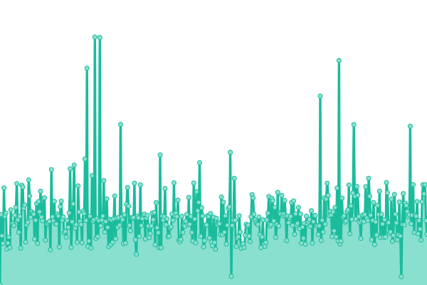
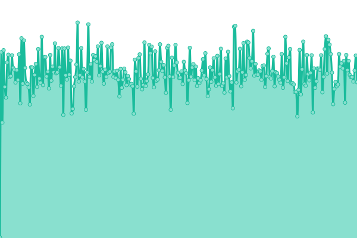

# [📈 Statut temps réel](https://dnum-mi.github.io/stats-sites-api): <!--live status--> **Tous les sytèmes sont opérationnels**

This repository contains the open-source uptime monitor and status page for [DNUM - MI](https://www.interieur.gouv.fr), powered by [Upptime](https://github.com/upptime/upptime).

With [Upptime](https://upptime.js.org), you can get your own unlimited and free uptime monitor and status page, powered entirely by a GitHub repository. We use [Issues](https://github.com/dnum-mi/stats-sites-api/issues) as incident reports, [Actions](https://github.com/dnum-mi/stats-sites-api/actions) as uptime monitors, and [Pages](https://dnum-mi.github.io/stats-sites-api) for the status page.

## [📈 Live Status](https://demo.upptime.js.org): <!--live status--> **Tous les sytèmes sont opérationnels**

<!--start: status pages-->
<!-- This summary is generated by Upptime (https://github.com/upptime/upptime) -->
<!-- Do not edit this manually, your changes will be overwritten -->
<!-- prettier-ignore -->
| URL | Status | History | Response Time | Uptime |
| --- | ------ | ------- | ------------- | ------ |
|  [Site Google](https://www.google.com) | Opérationnel | [site-google.yml](https://github.com/dnum-mi/stats-sites-api/commits/HEAD/history/site-google.yml) | 

 126ms
     
 | 

<a href="https://dnum-mi.github.io/stats-sites-api/history/site-google">100.00%</a>
    

|  [Site Personnes Décédées](https://deces.matchid.io/search?q=pompidou+georges) | Opérationnel | [site-personnes-decedees.yml](https://github.com/dnum-mi/stats-sites-api/commits/HEAD/history/site-personnes-decedees.yml) | 

 400ms
     
 | 

<a href="https://dnum-mi.github.io/stats-sites-api/history/site-personnes-decedees">100.00%</a>
    

|  [Site IA Flash](https://iaflash.fr/) | Opérationnel | [site-ia-flash.yml](https://github.com/dnum-mi/stats-sites-api/commits/HEAD/history/site-ia-flash.yml) | 

 335ms
     
 | 

<a href="https://dnum-mi.github.io/stats-sites-api/history/site-ia-flash">100.00%</a>
    

|  [Site Histovec](https://histovec.interieur.gouv.fr/histovec) | Opérationnel | [site-histovec.yml](https://github.com/dnum-mi/stats-sites-api/commits/HEAD/history/site-histovec.yml) | 

 872ms
     
 | 

<a href="https://dnum-mi.github.io/stats-sites-api/history/site-histovec">99.93%</a>
    

|  [Site SCAE RGA](https://www.sca-rga.interieur.gouv.fr/) | Opérationnel | [site-scae-rga.yml](https://github.com/dnum-mi/stats-sites-api/commits/HEAD/history/site-scae-rga.yml) | 

 713ms
     
 | 

<a href="https://dnum-mi.github.io/stats-sites-api/history/site-scae-rga">100.00%</a>
    

|  [Site ANTS](https://ants.gouv.fr) | Opérationnel | [site-ants.yml](https://github.com/dnum-mi/stats-sites-api/commits/HEAD/history/site-ants.yml) | 

 1558ms
     
 | 

<a href="https://dnum-mi.github.io/stats-sites-api/history/site-ants">100.00%</a>
    

|  [API Personnes décédées](https://deces.matchid.io/deces/api/v1/search?q=pompidou%20georges&fuzzy=false) | Opérationnel | [api-personnes-decedees.yml](https://github.com/dnum-mi/stats-sites-api/commits/HEAD/history/api-personnes-decedees.yml) | 

 560ms
     
 | 

<a href="https://dnum-mi.github.io/stats-sites-api/history/api-personnes-decedees">100.00%</a>
    

<!--end: status pages-->

[**Visit our status website →**](https://dnum-mi.github.io/stats-sites-api)

## 📄 License

- Powered by: [Upptime](https://github.com/upptime/upptime)
- Code: [MIT](./LICENSE) © [DNUM - MI](https://www.interieur.gouv.fr)
- Data in the `./history` directory: [Open Database License](https://opendatacommons.org/licenses/odbl/1-0/)
